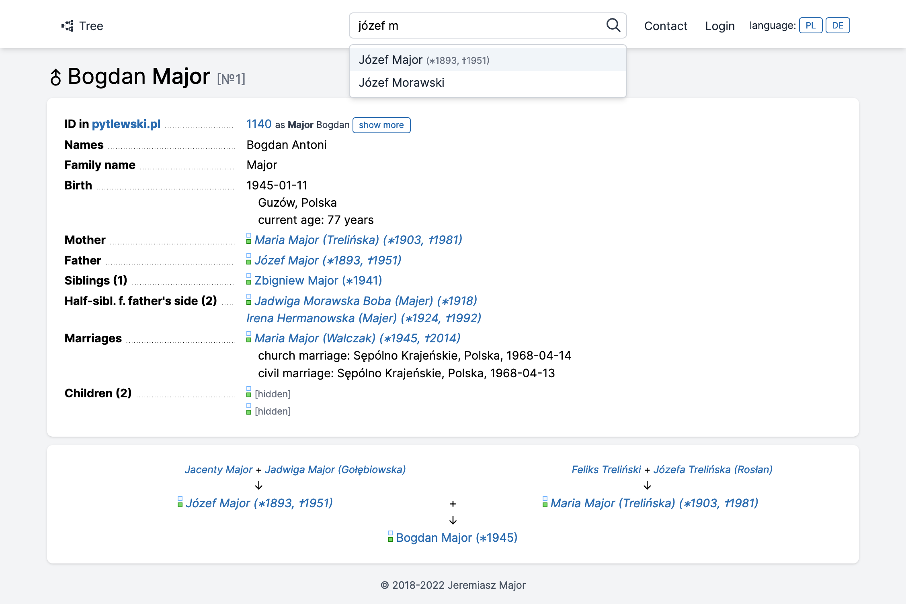

## About

Arbor is a genealogy application built in PHP 8 with Laravel framework.
For frontend it uses Tailwind CSS and Alpine.js.



## Installation

### Requirements

- PHP 8.1
- MySQL 8

### Installation

Clone this repository and install it like you normally install Laravel application.

- Install dependencies (`composer install && yarn install`)
- Generate assets with `yarn dev`
- Copy `.env.example` to `.env` and set environment variables
- Set application key with `php artisan key:generate`
- Run database migrations (`php artisan migrate`)

## Testing

This application uses PHPUnit for testing and PHPStan for static analysis. MySQL 8 is required to run tests. You may set the testing database name in `phpunit.xml` (defaults to `arbor_tests`).

```sh
vendor/bin/phpunit --testdox  # Tests
vendor/bin/phpstan analyse    # Static analysis
vendor/bin/php-cs-fixer fix   # Formatting
```
